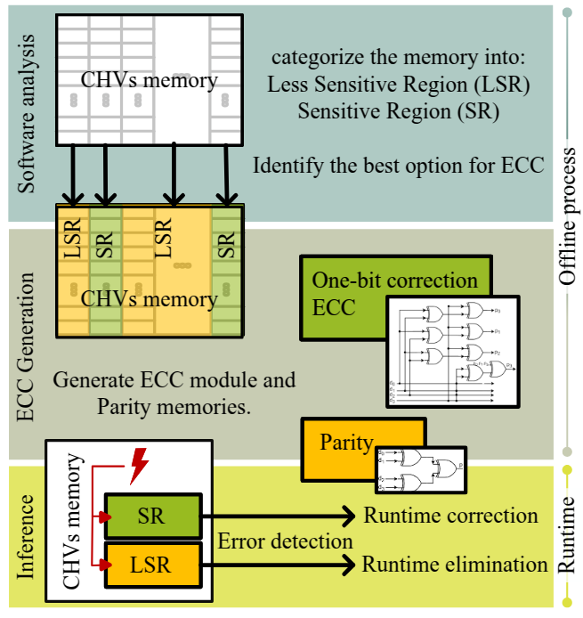
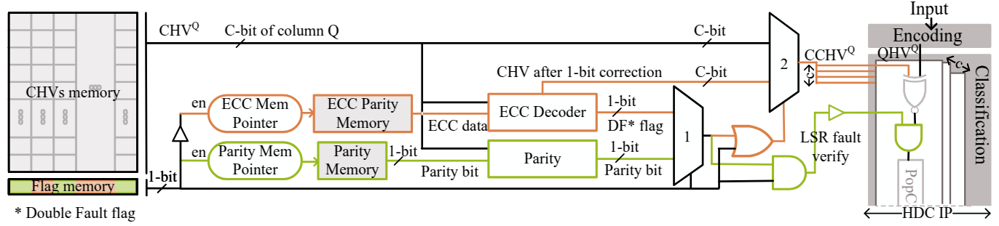

# **NUECC-HDC**  
**Non-Uniform Error Correction for Hyperdimensional Computing Edge Accelerators**  

## About NUECC-HDC  

Brain-inspired **Hyperdimensional Computing (HDC)** has gained traction as an efficient and lightweight machine learning paradigm. With advantages like **one-shot learning** and **resource efficiency**, HDC is well-suited for **edge devices** with limited computational resources.  

While HDC inherently exhibits **fault tolerance**, **soft errors in associative memory** can degrade system performance—especially in **safety-critical applications** where reliability is paramount. Traditional **Error-Correcting Codes (ECC)** are commonly employed to mitigate such faults, but their **high storage overhead** poses challenges for edge deployments.  

### **Our Contribution**  
We propose a **non-uniform fault correction framework** that enhances **HDC robustness** while preserving **hardware efficiency**.  

-  **Hamming weight-based fault sensitivity analysis** enables efficient classification of associative memory regions, avoiding time-intensive fault injection campaigns.  
-  **Region-wise protection strategy** selectively applies ECC to memory sections based on fault sensitivity, **minimizing overhead while ensuring resilience**.  
-  **Optimized for FPGA implementation**, demonstrating practical feasibility with minimal resource consumption.  

---

## **System Overview**  

The diagram below illustrates our proposed **non-uniform ECC mechanism** for HDC accelerators. This framework:  
 Identifies **sensitive** and **less sensitive** regions (**SR** & **LSR**).  
 Allocates **ECC resources selectively** to balance error correction and storage efficiency.  
 Enables **runtime fault detection and correction** with minimal hardware overhead.  

   

---

## **Hardware Overview**  

The following figure presents the **non-uniform ECC architecture** for **Class Hypervector (CHV)** within the HDC accelerator.  
- **Sensitive Regions (SR)** are highlighted in **orange**, requiring stricter ECC.  
- **Less Sensitive Regions (LSR)** are shown in **green**, optimized for reduced overhead.  

  

---

## **Getting Started**  

To set up the framework, follow these steps:  

- Clone this repository  
- Make a new project based on [RCEHDC](git@github.com:m-spr/NUECC-HDC.git) 
- Modify the IP by replacing the modules in the hardware folder as required.

If you find this work useful, please cite the following paper:
(Currently accepted and waiting for publication)

@inproceedings{roodsari20243,
  title={Non-Uniform Error Correction for Hyperdimensional Computing Edge Accelerators},
  author={Roodsari, Mahboobe Sadeghipour and Hemaram, Surendra and Tahoori, Mehdi},
  booktitle={2025 30th IEEE European Test Symposium (ETS)},
  year={2025},
  organization={IEEE}
}

Task List
------------
- [ ] add instructions to run the ECC python and memory generator codes
- [ ] add ECC memory to main project tcl
- [ ] add ECC module generator to the project

